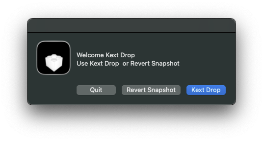
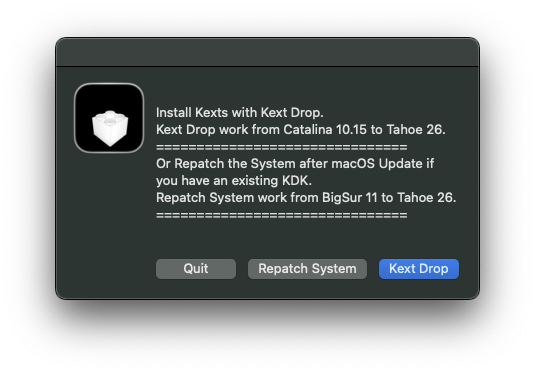
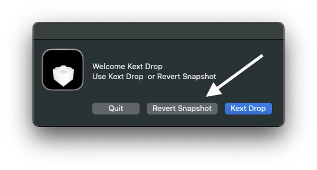

# Kext Drop an easy kexts installer in macOS
 
#### Kext Drop Is build from Xcode 16 on my system macOS Sequoia 15.6
- Credit: [Platypus](https://github.com/sveinbjornt/Platypus) - [Apple KDK
](https://developer.apple.com/documentation/apple-silicon/debugging-a-custom-kernel-extension) - [(Tester djams)](https://github.com/djams2904)

- Utility for Old Intel mac or Hackintosh
  
View Usage Video ➤ [Usage Video](https://github.com/chris1111/Kext-Drop/blob/main/Usage-Video.md)

Open ➥ [discussions](https://github.com/chris1111/Kext-Drop/discussions) ➥ [issues
](https://github.com/chris1111/Kext-Drop/issues)
#### Working ⬇︎
- Work from macOS Catalina 10.15 to macOS Tahoe 26 in both usage modes /S/L/E and /L/E
- The program download and install KDK automaticly.
#### To using this program:
* Gatekeeper must be disable
* SIP security must be disable
* You need a working ethernet connection on /S/L/E for Ventura and later because of the KDKs download. Snapshot disk requires Disable AMFI, NVRAM:boot-args: > amfi=0x80 or AMFIPass.kext without this boot args.
* config.plist: NVRAM:
7C436110-AB2A-4BBB-A880-FE41995C9F82: CSr:active-config > 03080000

#### Exemple: Installed AppleHDA.kext on macOS Tahoe 26 to make audio working.
- You need AppleALC. kext Lilu kext and your layout ID in OpenCore config.plist
- Use Kext Drop to install AppleHDA.kext in /System/Library/Extensions
  

### Use this utility correctly: ⬇︎ 
##### If you have any snapshot disk install from other utility on your system you have to use the Option `Revert Patch` before; then reboot and use Option `Kext-Drop`
##### Even if you have any KDK install from other utility on your system, you have to remove it in  ➤ `/library/Developer/KDKs`  

### If a boot problem occurs after using this utility, you must take responsibility for it.

 Download ➦ [Release Kext Drop](https://github.com/chris1111/Kext-Drop/releases/tag/V1)

[Main scipt](https://github.com/chris1111/Kext-Drop/blob/main/Source/Contents/Resources/Installer/Kext-Drop.app/Contents/Resources/script) -- [Patch Helper script](https://github.com/chris1111/Kext-Drop/blob/main/Source/Contents/Resources/Installer/Kext-Drop.app/Contents/Resources/Kext-Drop) - [Re Patched-System script](https://github.com/chris1111/Kext-Drop/blob/main/Source/Contents/Resources/Installer/RepatchSystem.app/Contents/Resources/Scripts/Patched-System) -- [main.scpt RepatchSystem](https://github.com/chris1111/Kext-Drop/blob/main/Source/Contents/Resources/Installer/RepatchSystem.app/Contents/Resources/Scripts/main.scpt) -- [main.scpt RevertSnapshot](https://github.com/chris1111/Kext-Drop/blob/main/Source/Contents/Resources/Installer/RevertSnapshot.app/Contents/Resources/Scripts/main.scpt)
